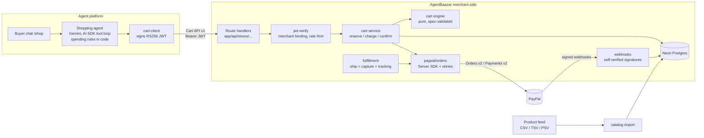
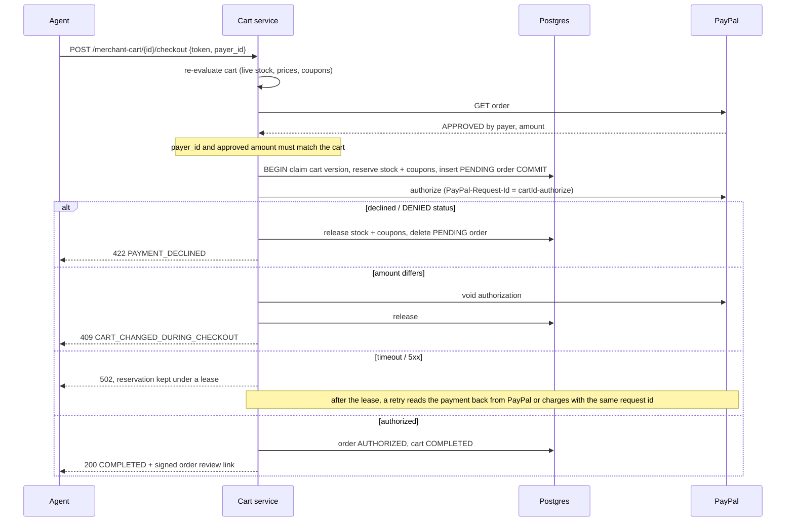

# AgentBaazar

**Agent-ready commerce for every small store, on PayPal.**

AI shopping agents are about to buy things for people. PayPal's agentic commerce stack lets an agent platform talk to a merchant through one contract: the **Cart API v1** (the "Store Sync" merchant contract). Big retailers will implement it. A sari shop with a Google Merchant feed will not.

AgentBaazar is that missing merchant side, open source. Give it a product feed, and the store gets a spec-conformant Cart API that agents can shop and pay through PayPal, plus buyer protection that a human checkout never needed: **the buyer is only charged when the merchant ships.**

> Built for the [PayPal AI Hackathon](https://paypalaihackathon.devpost.com/). **Live demo: https://agentbaazar.onrender.com** (PayPal sandbox). **Try it: the shopping agent at https://agentbaazar.onrender.com/shop and the merchant console at https://agentbaazar.onrender.com/console** (password in the submission's testing notes). The merchant side, the buyer agent and the console all work end to end, deployed, against the PayPal sandbox.

---

## What an agent can do with an AgentBaazar store

```text
agent: find a blue cotton kurta under $40
store: 2 results (search API)
agent: POST /merchant-cart  {kurta blue M, ship to Austin TX}
store: 200 INCOMPLETE  ITEM_OUT_OF_STOCK
       resolution: "Switch to Kurta - Indigo, M" (HIGH)  + a machine-applicable patch
agent: PUT /merchant-cart/{id}  (patch applied)
store: 200 READY  total $49.21  payment_method.token = PayPal order 1WD48354GS436435P
agent: POST /agentic/offers
store: WELCOME10-SGRQ (10% off, one cart, expires in 30 min)
agent: PUT with the coupon
store: VALID  total $44.99  (PayPal order PATCHed to match)
buyer: approves $44.99 in PayPal
agent: POST /merchant-cart/{id}/checkout
store: COMPLETED  order AB-1003  (authorized, NOT captured)
merchant ships -> capture + tracking posted to PayPal -> buyer is charged
```

That transcript is a real run of [`pnpm smoke`](scripts/smoke.ts) against the PayPal sandbox (see [Evidence](#sandbox-evidence)).

## The buyer agent

[`/shop`](https://agentbaazar.onrender.com/shop) is an AI shopping agent (Gemini on the free tier, AI SDK 7) that buys from AgentBaazar stores **only through their Cart API**, the way any agent platform would: it signs a JWT per call and never touches the store's database.

Tell it what you need and a budget. It searches every store, opens a cart, fixes what the store flags using the store's own resolution options, asks for a discount, then asks you to approve the payment in PayPal. Once you approve, it places the order; the payment is authorized, and you are charged when the store ships. The chat's ledger (the *khata*) shows every line the store charged against your budget.

The model proposes; **code decides** what money can move ([`src/platform/agent/policy.ts`](src/platform/agent/policy.ts), tested):

| The agent wants to | What happens |
|---|---|
| swap to an equivalent in-stock item at the same or lower price | applied automatically |
| accept a higher price, a back-order or a pre-order, or remove the last item | waits for the buyer's **Accept** (AI SDK tool approval) |
| send the buyer to the store's site, or contact support | refused; the agent explains |
| set or raise the budget | allowed only if the buyer wrote that amount; otherwise the buyer is asked |
| pay without a budget, or above it | refused, whatever the prompt says |
| pay at all | only after the buyer approved in PayPal, which is a client-side tool the chat completes when the store sees the approval |

Free LLM tiers get busy, so every call goes through a model pool ([`src/llm.ts`](src/llm.ts)): the buyer agent uses `gemini-3.5-flash-lite` (about a second per step), then `gemini-3.6-flash`, Gemma 4 and Groq `gpt-oss-120b`. A model that refuses for quota or load rests for exactly the time the provider states, and when every model is resting the call waits briefly for the soonest one.

## The merchant console

[`/console`](https://agentbaazar.onrender.com/console) is an [AG Studio](https://www.ag-grid.com/studio/) dashboard over the stores' live data, refreshed on every cart, order and PayPal webhook event:

- **Agent sales, orders to ship, orders**, and a custom **agent cart funnel** widget (cart opened → ready to pay → approved in PayPal → payment authorized → captured on ship) built with AG Charts and Studio's custom-widget API, with cross-filtering.
- An orders grid with a **Ship** button: it captures the PayPal authorization and posts the tracking number to PayPal.
- AgentBaazar theme (indigo, madder, the khata palette) with dark mode.
- An **AI analyst** built on Studio's agent framework: "add a donut chart of agent sales by store" or "which problems did agents run into most often?". It is a custom agent with our own tools: `add_widget` builds a fully configured widget in one call and `summarize` answers from the loaded rows. That keeps a request to about two model calls of ~7 kB, where Studio's built-in team needs ~10 calls of up to 64 kB, which free LLM tiers cannot serve. Studio talks to the model through our adapter ([`src/console/llm-adapter.ts`](src/console/llm-adapter.ts)) and [`/api/console/studio-llm`](app/api/console/studio-llm/route.ts), so no key reaches the browser.

All model calls go through one pool ([`src/llm.ts`](src/llm.ts)) across Gemini 3.5 Flash-Lite, 3.6 Flash, 3.1 Flash-Lite and Gemma 4: each has its own free quota (measured: 3.8 Flash 20 requests a day, 3.6 Flash 5 a minute, Gemma 16k tokens a minute), a model that refuses rests for the time the provider states, and when all are resting the call waits for the soonest.

## Why it is different

| | A typical checkout | AgentBaazar |
|---|---|---|
| Who fixes a broken cart | a human reading an error | the agent: every issue carries `resolution_options`, and each option carries a `metadata.apply` patch the agent can apply verbatim |
| When the buyer pays | at checkout | at checkout the payment is **authorized**; it is **captured when the merchant ships** (`PAYMENT_MODE` per merchant) |
| Catalog onboarding | an integration project | upload the feed you already have for Google Shopping, PayPal, or OpenAI ACP |
| Failure handling | "something went wrong" | reserve, then charge, then confirm, with compensation. Idempotent request ids mean PayPal never charges twice for one cart |

## Architecture



### Checkout, step by step



## PayPal features used

| Feature | Where |
|---|---|
| **Cart API v1** (Store Sync merchant contract): create, get, full-replacement update, checkout; `validation_issues` with spec codes and `resolution_options` | [`src/merchant/cart/service.ts`](src/merchant/cart/service.ts), [`src/merchant/cart/engine.ts`](src/merchant/cart/engine.ts), schema in [`src/cart-spec/schema.ts`](src/cart-spec/schema.ts) |
| Cart API **JWT auth** (`merchant_id`, `scope: ["cart"]`), verified against a JWKS, bound to the store | [`src/merchant/auth/jwt-verify.ts`](src/merchant/auth/jwt-verify.ts), [`src/merchant/api/http.ts`](src/merchant/api/http.ts) (`storeRoute`) |
| **Orders v2**: create (`AUTHORIZE` or `CAPTURE` intent, itemized breakdown, shipping, discount), PATCH as the cart changes, authorize, capture | [`src/merchant/paypal/orders.ts`](src/merchant/paypal/orders.ts) |
| **Payments v2**: capture an authorization on ship, void on cancel, full and partial refunds, reauthorize | [`src/merchant/paypal/orders.ts`](src/merchant/paypal/orders.ts), [`src/merchant/fulfillment.ts`](src/merchant/fulfillment.ts) |
| **Package tracking** posted to the order on ship | `addTracking` in [`orders.ts`](src/merchant/paypal/orders.ts) |
| **`PayPal-Request-Id` idempotency** on every money-moving call; SDK retries on 429/5xx | [`orders.ts`](src/merchant/paypal/orders.ts) (`sdk`, `run`) |
| **Webhooks**, self-verified (CRC32 + SHA256withRSA, cert URL pinned to PayPal hosts), deduplicated by event id, reconciled with conditional updates: approvals, authorizations, captures, refunds, reversals, disputes | [`src/merchant/paypal/webhook-verify.ts`](src/merchant/paypal/webhook-verify.ts), [`src/merchant/webhooks.ts`](src/merchant/webhooks.ts) |
| Official **`@paypal/paypal-server-sdk`** | [`orders.ts`](src/merchant/paypal/orders.ts) |

### Where AgentBaazar deliberately differs from the Store Sync pattern

PayPal's Store Sync guide captures at checkout, and a `COMPLETED` cart means the payment was captured. AgentBaazar's default (`paymentMode: "authorize"` per merchant) **authorizes** at checkout and **captures when the merchant ships**: a `COMPLETED` cart then means "paid for with a PayPal authorization, held until shipping". An agent buying for someone should not take their money for an item that never ships. A store can opt into capture-at-checkout (`paymentMode: "capture"`), which is the exact Store Sync behaviour; both paths are implemented and tested.

### Beyond the spec (clearly namespaced extensions)

- `GET /agentic/search`: catalog search for discovery ([`discovery.ts`](src/merchant/discovery.ts))
- `POST /agentic/offers`: the store mints a one-time, per-cart coupon (first order, bundle) that the agent can apply ([`discovery.ts`](src/merchant/discovery.ts))
- `resolution_options[].metadata.apply`: a typed `CartPatch` ([`src/cart-spec/extensions.ts`](src/cart-spec/extensions.ts)) so agents fix carts without guessing
- `GET` on a cart shows `status: READY` and, once PayPal's `CHECKOUT.ORDER.APPROVED` webhook arrives, the buyer's `payer_id`, so an agent knows when it can check out
- 422 responses carry the spec's optional `business_context` (a `ValidationIssue` with `resolution_options`), so a failed checkout is as actionable as a failed PUT
- Signed order review page for the buyer ([`app/m/[store]/orders/[orderId]/page.tsx`](app/m/%5Bstore%5D/orders/%5BorderId%5D/page.tsx)) and product pages that the feeds link to ([`app/m/[store]/p/[productId]/page.tsx`](app/m/%5Bstore%5D/p/%5BproductId%5D/page.tsx))

## The cart engine handles

Out of stock (with in-stock sibling variants as alternatives), insufficient inventory, back-orders and pre-orders (accepted through a custom option), price changes since the agent last looked, stores opting items out of agent checkout (`REDIRECT_TO_MERCHANT`), missing or invalid addresses, regions the store does not serve, PO boxes for fragile items, required checkout fields (e.g. allergy information), shipping options by weight and region, coupons (minimum subtotal, usage limits, expiry, a cap on the combined discount, free shipping), per-state sales tax, and store maintenance windows.

Money is integer cents end to end. Tax is computed in parts per million with half-up rounding, tested against exact BigInt arithmetic for every amount up to $1,000 ([`money.test.ts`](src/merchant/cart/money.test.ts)).

## Sandbox evidence

From a `pnpm smoke` run against the live deployment (https://agentbaazar.onrender.com) with a real sandbox buyer approval, October 2026:

| Step | PayPal id |
|---|---|
| Order created with intent `AUTHORIZE`, then PATCHed from $49.21 to $44.99 after the coupon | order `0L264289453770740` (AB-1005) |
| Authorization at checkout (not captured); replaying the checkout returns the same result | `3CC090218U6079423` |
| Capture on ship, tracking `1Z999AA195171195` posted | capture `04N42508GA558362H` |
| $5.00 partial refund through the admin API, sent twice with one `request_id`: PayPal refunded once | refund `1J073660WF579632V` |
| Real webhooks delivered to the deployment, signature-verified, and reconciled | `CHECKOUT.ORDER.APPROVED`, `PAYMENT.AUTHORIZATION.CREATED`, `PAYMENT.CAPTURE.COMPLETED`, `PAYMENT.CAPTURE.REFUNDED` |

## Quick start (about 10 minutes, no credit card anywhere)

You need Node 24+, pnpm 11, a free [Neon](https://neon.tech) Postgres database, and a free [PayPal developer](https://developer.paypal.com) account.

```bash
git clone https://github.com/rohith1005H/AgentBaazar && cd AgentBaazar
pnpm install
cp .env.example .env    # fill in DATABASE_URL, PAYPAL_CLIENT_ID, PAYPAL_CLIENT_SECRET,
                        # APP_SECRET (openssl rand -hex 32), STORE_ADMIN_TOKEN (openssl rand -hex 16),
                        # GOOGLE_GENERATIVE_AI_API_KEY (and optionally GROQ_API_KEY) for the buyer agent
pnpm db:push            # create the merchant and platform schemas
pnpm seed               # three demo stores, their feeds, and a platform signing key
pnpm dev
pnpm smoke              # the full flow above; prints a PayPal link to approve as your sandbox buyer
open http://localhost:3000/shop   # the buyer agent
```

PayPal credentials: developer.paypal.com → Apps & Credentials → Sandbox → create an app. Sandbox buyer: Testing Tools → Sandbox Accounts → the Personal account. Gemini key: aistudio.google.com → Get API key (free, billing off). Groq key: console.groq.com.

Webhooks need a public HTTPS URL. Expose the dev server (for example `cloudflared tunnel --url http://localhost:3000`), set `PUBLIC_URL` to the tunnel URL, run `pnpm register-webhook --url https://<tunnel>/api/paypal/webhooks`, and put the printed id in `PAYPAL_WEBHOOK_ID`. When the tunnel URL changes, run it again: it moves the same webhook to the new URL.

### Deploy (free, no card)

[](https://render.com/deploy?repo=https://github.com/rohith1005H/AgentBaazar)

[`render.yaml`](render.yaml) describes one free Render web service in Ohio, next to a Neon database in `us-east-2`. After it is created, add the secrets in the service's Environment tab: `DATABASE_URL`, `APP_SECRET`, `STORE_ADMIN_TOKEN`, `PAYPAL_CLIENT_ID`, `PAYPAL_CLIENT_SECRET`, `PAYPAL_WEBHOOK_ID`, `PUBLIC_URL` (the `onrender.com` URL), `AGENTIC_JWKS_URL` (`<PUBLIC_URL>/.well-known/jwks.json`), `JWT_ISSUER` (`PUBLIC_URL`), `GOOGLE_GENERATIVE_AI_API_KEY` and `GROQ_API_KEY`. Then run `pnpm seed` and `pnpm register-webhook --url <PUBLIC_URL>/api/paypal/webhooks` locally with `PUBLIC_URL` pointing at the deployment. Free instances sleep after 15 idle minutes; [`.github/workflows/keep-demo-awake.yml`](.github/workflows/keep-demo-awake.yml) pings `/api/health` every 5 minutes to keep the demo awake.

### Demo stores

| Store | Feed format | What it exercises |
|---|---|---|
| `patel-textiles` | Google Product Feed (CSV) | out of stock with sibling alternatives, size and color variants |
| `kaveri-coffee` | OpenAI ACP (TSV) | required checkout field (allergy info), back-order, an item opted out of agent checkout |
| `lumen-ceramics` | PayPal Enhanced (CSV) | fragile items (no PO boxes), lower-48-only shipping, pre-order |

Bring your own: `pnpm import-feed <store-id> <feed-file>`.

## API

All Cart API routes live under `/api/stores/{store}/paypal/v1` and require `Authorization: Bearer <JWT>`.

| Method | Path | Auth |
|---|---|---|
| POST | `/merchant-cart` | Cart JWT |
| GET, PUT | `/merchant-cart/{cartId}` | Cart JWT (only the platform that created the cart) |
| POST | `/merchant-cart/{cartId}/checkout` | Cart JWT |
| GET | `/api/stores/{store}/agentic/search?q=&max_price=` | public |
| POST | `/api/stores/{store}/agentic/offers` | Cart JWT |
| GET | `/api/stores/{store}/orders/{orderId}` | Cart JWT (placing platform only) |
| POST | `/api/stores/{store}/orders/{orderId}/ship`, `/cancel`, `/refund` (refund takes a required `request_id`, so a retry never refunds twice) | `STORE_ADMIN_TOKEN` |
| POST | `/api/paypal/webhooks` | PayPal signature |
| GET | `/.well-known/jwks.json` | public, the platform's signing keys |
| GET | `/api/health` (`?deep=1` checks the database) | public |

Errors use PayPal's envelope (`name`, `message`, `debug_id`, `details[]`).

## Tests

```bash
pnpm test          # unit + integration tests
pnpm typecheck     # generates Next.js route types, then tsc
pnpm lint
```

- Unit tests: the cart engine, money math, feed parsing, JWT verification, webhook signature verification, route auth and merchant binding.
- **Integration tests** ([`src/merchant/integration.test.ts`](src/merchant/integration.test.ts)) run the merchant side against real Postgres with an in-memory PayPal ([`src/test/fake-paypal.ts`](src/test/fake-paypal.ts)) that can decline, return a `DENIED` or `DECLINED` status, authorize a different amount, lose its response after charging, or run a concurrent request mid-charge. Checkout: idempotent replay, compensation, the concurrent-edit 409, resuming after a lost response without a second charge (and 409 while the first attempt still holds its lease), voiding a charge whose reservation was released, a sell-out between validation and reservation. Fulfillment: capture on ship, declined capture, cancel returning stock and coupons exactly once alongside the `VOIDED` webhook, refund idempotency and totals. Webhooks: dashboard refunds, duplicate deliveries, and redelivery of an event whose processing failed half way. Set `TEST_DATABASE_URL` (in `.env.local`) to a throwaway database, such as a Neon branch, to run them; otherwise they are skipped.
- `pnpm smoke`: the end-to-end run against the real sandbox.

## Security

- Cart JWTs are verified (RS256/ES256, `exp` required, optional `aud`/`iss` pinning) and the JWT's `merchant_id` must match the store in the URL. Carts and orders are visible only to the platform that created them.
- Webhooks are rejected unless PayPal's signature verifies. PayPal's simulator signature is accepted only with `WEBHOOK_ACCEPT_SIMULATOR=true` (local testing).
- The platform's private signing key is stored encrypted (AES-256-GCM under `APP_SECRET`).
- Order review links are HMAC-signed. Admin endpoints compare tokens in constant time.
- Logs never include tokens or buyer details (authorization fields are also redacted by the logger). Rate limited per store and caller.
- Dependencies are pinned to exact versions.

## Project layout

```text
app/                         Next.js 16 route handlers and pages
src/cart-spec/               Cart API v1 models (zod) + AgentBaazar extensions
src/merchant/cart/           engine (pure), service (checkout state machine), repo, money
src/merchant/catalog/        feed parsing (Google, PayPal Enhanced, OpenAI ACP) and import
src/merchant/paypal/         Orders/Payments client, webhook signature verification
src/merchant/                webhooks, fulfillment (ship/cancel/refund), discovery
src/platform/agent/          buyer agent: tools, spending policy, sessions, web search
src/console/                 AG Studio console: data, report, theme, custom widget, analyst agent
src/platform/stores/         agent-platform side: JWT signing, key rotation, cart client
scripts/                     seed, smoke, import-feed, register-webhook, simulate-webhook
demo-data/                   three demo stores and their feeds
```

## Roadmap

- [x] Cart API v1 merchant side, Orders v2 / Payments v2, webhooks, capture-on-ship
- [x] Buyer agent (Gemini, free tier) that shops any AgentBaazar store through the Cart API: https://agentbaazar.onrender.com/shop
- [x] Merchant console (AG Studio): live agent carts and orders, ship to capture, AI analyst
- [ ] Merchant MCP server
- [x] Hosted demo: https://agentbaazar.onrender.com (Render free tier, kept awake by a scheduled GitHub Action)

## Stack

Next.js 16 · TypeScript (strict) · Neon Postgres + Drizzle · `@paypal/paypal-server-sdk` · AI SDK 7 + Gemini/Gemma · AG Studio 3 · Channel3 · zod · jose · Vitest · Biome. Everything runs on free tiers.

## License

Apache-2.0
