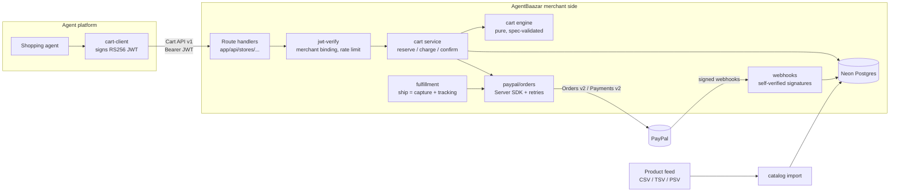

# AgentBaazar

**Agent-ready commerce for every small store, on PayPal.**

AI shopping agents are about to buy things for people. PayPal's agentic commerce stack lets an agent platform talk to a merchant through one contract: the **Cart API v1** (the "Store Sync" merchant contract). Big retailers will implement it. A sari shop with a Google Merchant feed will not.

AgentBaazar is that missing merchant side, open source. Give it a product feed, and the store gets a spec-conformant Cart API that agents can shop and pay through PayPal, plus buyer protection that a human checkout never needed: **the buyer is only charged when the merchant ships.**

> Built for the [PayPal AI Hackathon](https://paypalaihackathon.devpost.com/). Status: the merchant side (everything below) works end to end against the PayPal sandbox. The buyer agent and the merchant console are in progress; see [Roadmap](#roadmap).

---

## What an agent can do with an AgentBaazar store

```text
agent: find a blue cotton kurta under $40
store: 2 results (search API)
agent: POST /merchant-cart  {kurta blue M, ship to Austin TX}
store: 200 INCOMPLETE  ITEM_OUT_OF_STOCK
       resolution: "Switch to Kurta - Indigo, M" (HIGH)  + a machine-applicable patch
agent: PUT /merchant-cart/{id}  (patch applied)
store: 201 VALID  total $49.21  payment_method.token = PayPal order 4KK584838Y673292P
agent: POST /agentic/offers
store: WELCOME10-2VV6 (10% off, one cart, expires in 30 min)
agent: PUT with the coupon
store: VALID  total $44.99  (PayPal order PATCHed to match)
buyer: approves $44.99 in PayPal
agent: POST /merchant-cart/{id}/checkout
store: COMPLETED  order AB-1002  (authorized, NOT captured)
merchant ships -> capture + tracking posted to PayPal -> buyer is charged
```

That transcript is a real run of [`pnpm smoke`](scripts/smoke.ts) against the PayPal sandbox (see [Evidence](#sandbox-evidence)).

## Why it is different

| | A typical checkout | AgentBaazar |
|---|---|---|
| Who fixes a broken cart | a human reading an error | the agent: every issue carries `resolution_options`, and each option carries a `metadata.apply` patch the agent can apply verbatim |
| When the buyer pays | at checkout | at checkout the payment is **authorized**; it is **captured when the merchant ships** (`PAYMENT_MODE` per merchant) |
| Catalog onboarding | an integration project | upload the feed you already have for Google Shopping, PayPal, or OpenAI ACP |
| Failure handling | "something went wrong" | reserve, then charge, then confirm, with compensation. Idempotent request ids mean PayPal never charges twice for one cart |

## Architecture



### Checkout, step by step

```mermaid
sequenceDiagram
  participant Ag as Agent
  participant S as Cart service
  participant DB as Postgres
  participant PP as PayPal

  Ag->>S: POST /merchant-cart/{id}/checkout {token, payer_id}
  S->>S: re-evaluate cart (live stock, prices, coupons)
  S->>PP: GET order
  PP-->>S: APPROVED by payer, amount
  Note over S: payer_id and approved amount must match the cart
  S->>DB: BEGIN claim cart version, reserve stock + coupons, insert PENDING order COMMIT
  S->>PP: authorize (PayPal-Request-Id = cartId-authorize)
  alt declined / DENIED status
    S->>DB: release stock + coupons, delete PENDING order
    S-->>Ag: 422 PAYMENT_DECLINED
  else amount differs
    S->>PP: void authorization
    S->>DB: release
    S-->>Ag: 409 CART_CHANGED_DURING_CHECKOUT
  else timeout / 5xx
    S-->>Ag: 502, reservation kept; a retry resumes with the same request id
  else authorized
    S->>DB: order AUTHORIZED, cart COMPLETED
    S-->>Ag: 200 COMPLETED + signed order review link
  end
```

## PayPal features used

| Feature | Where |
|---|---|
| **Cart API v1** (Store Sync merchant contract): create, get, full-replacement update, checkout; `validation_issues` with spec codes and `resolution_options` | [`src/merchant/cart/service.ts`](src/merchant/cart/service.ts), [`src/merchant/cart/engine.ts`](src/merchant/cart/engine.ts), schema in [`src/cart-spec/schema.ts`](src/cart-spec/schema.ts) |
| Cart API **JWT auth** (`merchant_id`, `scope: ["cart"]`), verified against a JWKS, bound to the store | [`src/merchant/auth/jwt-verify.ts`](src/merchant/auth/jwt-verify.ts), [`src/merchant/api/http.ts`](src/merchant/api/http.ts) (`storeRoute`) |
| **Orders v2**: create (`AUTHORIZE` or `CAPTURE` intent, itemized breakdown, shipping, discount), PATCH as the cart changes, authorize, capture | [`src/merchant/paypal/orders.ts`](src/merchant/paypal/orders.ts) |
| **Payments v2**: capture an authorization on ship, void on cancel, full and partial refunds, reauthorize | [`src/merchant/paypal/orders.ts`](src/merchant/paypal/orders.ts), [`src/merchant/fulfillment.ts`](src/merchant/fulfillment.ts) |
| **Package tracking** posted to the order on ship | `addTracking` in [`orders.ts`](src/merchant/paypal/orders.ts) |
| **`PayPal-Request-Id` idempotency** on every money-moving call; SDK retries on 429/5xx | [`orders.ts`](src/merchant/paypal/orders.ts) (`sdk`, `run`) |
| **Webhooks**, self-verified (CRC32 + SHA256withRSA, cert URL pinned to PayPal hosts), deduplicated by event id, reconciled with conditional updates: approvals, authorizations, captures, refunds, reversals, disputes | [`src/merchant/paypal/webhook-verify.ts`](src/merchant/paypal/webhook-verify.ts), [`src/merchant/webhooks.ts`](src/merchant/webhooks.ts) |
| Official **`@paypal/paypal-server-sdk`** | [`orders.ts`](src/merchant/paypal/orders.ts) |

### Beyond the spec (clearly namespaced extensions)

- `GET /agentic/search`: catalog search for discovery ([`discovery.ts`](src/merchant/discovery.ts))
- `POST /agentic/offers`: the store mints a one-time, per-cart coupon (first order, bundle) that the agent can apply ([`discovery.ts`](src/merchant/discovery.ts))
- `resolution_options[].metadata.apply`: a typed `CartPatch` ([`src/cart-spec/extensions.ts`](src/cart-spec/extensions.ts)) so agents fix carts without guessing
- Signed order review page for the buyer ([`app/m/[store]/orders/[orderId]/page.tsx`](app/m/%5Bstore%5D/orders/%5BorderId%5D/page.tsx))

## The cart engine handles

Out of stock (with in-stock sibling variants as alternatives), insufficient inventory, back-orders and pre-orders (accepted through a custom option), price changes since the agent last looked, stores opting items out of agent checkout (`REDIRECT_TO_MERCHANT`), missing or invalid addresses, regions the store does not serve, PO boxes for fragile items, required checkout fields (e.g. allergy information), shipping options by weight and region, coupons (minimum subtotal, usage limits, expiry, a cap on the combined discount, free shipping), per-state sales tax, and store maintenance windows.

Money is integer cents end to end. Tax is computed in parts per million with half-up rounding, tested against exact BigInt arithmetic for every amount up to $1,000 ([`money.test.ts`](src/merchant/cart/money.test.ts)).

## Sandbox evidence

From a `pnpm smoke` run with a real sandbox buyer approval (October 2026):

| Step | PayPal id |
|---|---|
| Order created with intent `AUTHORIZE`, then PATCHed from $49.21 to $44.99 after the coupon | order `4KK584838Y673292P` |
| Authorization at checkout (not captured) | `1AC80273G87881435` |
| Capture on ship, tracking `1Z999AA148865433` posted | capture `6H166249T63296819` |
| $5.00 partial refund through the admin API | refund `1RT27968CC531804V` |
| Real webhooks received, signature-verified, and reconciled | `CHECKOUT.ORDER.APPROVED`, `PAYMENT.AUTHORIZATION.CREATED`, `PAYMENT.CAPTURE.COMPLETED`, `PAYMENT.CAPTURE.REFUNDED` |

## Quick start (about 10 minutes, no credit card anywhere)

You need Node 24+, pnpm 11, a free [Neon](https://neon.tech) Postgres database, and a free [PayPal developer](https://developer.paypal.com) account.

```bash
git clone https://github.com/rohith1005H/AgentBaazar && cd AgentBaazar
pnpm install
cp .env.example .env    # fill in DATABASE_URL, PAYPAL_CLIENT_ID, PAYPAL_CLIENT_SECRET,
                        # APP_SECRET (openssl rand -hex 32), STORE_ADMIN_TOKEN (openssl rand -hex 16)
pnpm db:push            # create the merchant and platform schemas
pnpm seed               # three demo stores, their feeds, and a platform signing key
pnpm dev
pnpm smoke              # the full flow above; prints a PayPal link to approve as your sandbox buyer
```

PayPal credentials: developer.paypal.com → Apps & Credentials → Sandbox → create an app. Sandbox buyer: Testing Tools → Sandbox Accounts → the Personal account.

Webhooks need a public URL. Expose the dev server (for example `cloudflared tunnel --url http://localhost:3000`), set `PUBLIC_URL` to the tunnel URL, then run `pnpm register-webhook` and put the printed id in `PAYPAL_WEBHOOK_ID`.

### Demo stores

| Store | Feed format | What it exercises |
|---|---|---|
| `patel-textiles` | Google Product Feed (CSV) | out of stock with sibling alternatives, size and color variants |
| `kaveri-coffee` | OpenAI ACP (TSV) | required checkout field (allergy info), back-order, an item opted out of agent checkout |
| `lumen-ceramics` | PayPal Enhanced (CSV) | fragile items (no PO boxes), lower-48-only shipping, pre-order |

Bring your own: `pnpm import-feed <store-id> <feed-file>`.

## API

All Cart API routes live under `/api/stores/{store}/paypal/v1` and require `Authorization: Bearer <JWT>`.

| Method | Path | Auth |
|---|---|---|
| POST | `/merchant-cart` | Cart JWT |
| GET, PUT | `/merchant-cart/{cartId}` | Cart JWT (only the platform that created the cart) |
| POST | `/merchant-cart/{cartId}/checkout` | Cart JWT |
| GET | `/api/stores/{store}/agentic/search?q=&max_price=` | public |
| POST | `/api/stores/{store}/agentic/offers` | Cart JWT |
| GET | `/api/stores/{store}/orders/{orderId}` | Cart JWT (placing platform only) |
| POST | `/api/stores/{store}/orders/{orderId}/ship`, `/cancel`, `/refund` | `STORE_ADMIN_TOKEN` |
| POST | `/api/paypal/webhooks` | PayPal signature |
| GET | `/.well-known/jwks.json` | public, the platform's signing keys |
| GET | `/api/health` (`?deep=1` checks the database) | public |

Errors use PayPal's envelope (`name`, `message`, `debug_id`, `details[]`).

## Tests

```bash
pnpm test          # 87 tests
pnpm typecheck && pnpm lint
```

- Unit tests: the cart engine, money math, feed parsing, JWT verification, webhook signature verification, route auth and merchant binding.
- **Integration tests** ([`service.integration.test.ts`](src/merchant/cart/service.integration.test.ts)) run the cart service against real Postgres with an in-memory PayPal ([`src/test/fake-paypal.ts`](src/test/fake-paypal.ts)) that can decline, return a `DENIED` status, authorize a different amount, lose its response after charging, or run a concurrent request mid-charge. They cover idempotent replay, compensation, the concurrent-edit 409, resuming after a lost response without a second charge, and a sell-out between validation and reservation. Set `TEST_DATABASE_URL` (in `.env.local`) to a throwaway database, such as a Neon branch, to run them; otherwise they are skipped.
- `pnpm smoke`: the end-to-end run against the real sandbox.

## Security

- Cart JWTs are verified (RS256/ES256, `exp` required, optional `aud`/`iss` pinning) and the JWT's `merchant_id` must match the store in the URL. Carts and orders are visible only to the platform that created them.
- Webhooks are rejected unless PayPal's signature verifies. PayPal's simulator signature is accepted only with `WEBHOOK_ACCEPT_SIMULATOR=true` (local testing).
- The platform's private signing key is stored encrypted (AES-256-GCM under `APP_SECRET`).
- Order review links are HMAC-signed. Admin endpoints compare tokens in constant time.
- Logs never include tokens or buyer details (authorization fields are also redacted by the logger). Rate limited per store and caller.
- Dependencies are pinned to exact versions.

## Project layout

```text
app/                         Next.js 16 route handlers and pages
src/cart-spec/               Cart API v1 models (zod) + AgentBaazar extensions
src/merchant/cart/           engine (pure), service (checkout state machine), repo, money
src/merchant/catalog/        feed parsing (Google, PayPal Enhanced, OpenAI ACP) and import
src/merchant/paypal/         Orders/Payments client, webhook signature verification
src/merchant/                webhooks, fulfillment (ship/cancel/refund), discovery
src/platform/                agent-platform side: JWT signing, key rotation, cart client
scripts/                     seed, smoke, import-feed, register-webhook, simulate-webhook
demo-data/                   three demo stores and their feeds
```

## Roadmap

- [x] Cart API v1 merchant side, Orders v2 / Payments v2, webhooks, capture-on-ship
- [ ] Buyer agent (Gemini, free tier) that shops any AgentBaazar store through the Cart API
- [ ] Merchant console: live agent carts and orders, ship/refund
- [ ] Merchant MCP server
- [ ] Hosted demo

## Stack

Next.js 16 · TypeScript (strict) · Neon Postgres + Drizzle · `@paypal/paypal-server-sdk` · zod · jose · Vitest · Biome. Everything runs on free tiers.

## License

Apache-2.0
